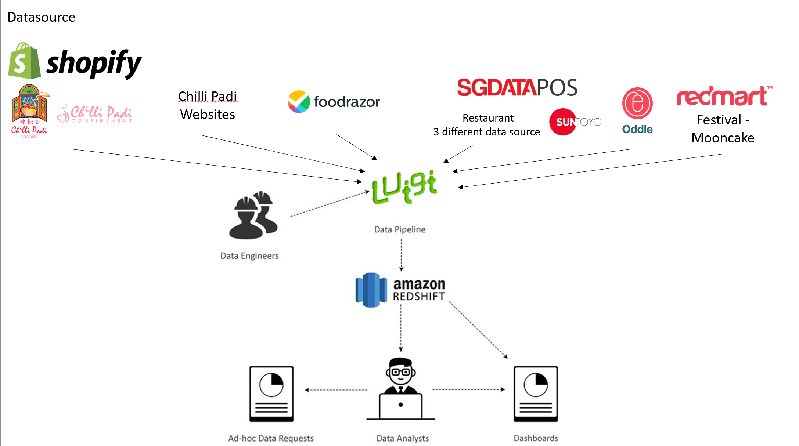

# **Transformation to a Data Driven Company**

# Table of Contents
- [**Transformation to a Data Driven Company**](#transformation-to-a-data-driven-company)
- [Table of Contents](#table-of-contents)
- [Vision](#vision)
- [Background](#background)
  - [The Business (ChilliPadi Group)](#the-business-chillipadi-group)
    - 
  - [Tech Stack](#tech-stack)
    - [**Websites**](#websites)
    - [**Backend - Data Sources**](#backend---data-sources)
- [Current Issues](#current-issues)
  - [Data Sources](#data-sources)
    - [Numerous Isolated Sources](#numerous-isolated-sources)
    - [Difficulty retrieving data](#difficulty-retrieving-data)
  - [Analysis](#analysis)
    - [Ad-hoc Basis](#ad-hoc-basis)
    - [Unstructure](#unstructure)
    - [Lack Focus](#lack-focus)
- [Proposed Infrastructure](#proposed-infrastructure)
  - [Data Warehouse](#data-warehouse)
    - [The Warehouse Itself](#the-warehouse-itself)
      - [AWS Redshift](#aws-redshift)
    - [ETL Pipeline](#etl-pipeline)
      - [Luigi (Spotify)](#luigi-spotify)
      - [Airflow (Airbnb)](#airflow-airbnb)
  - [Tasks (DAGs)](#tasks-dags)
  - [Analysis (Warehouse Frontend)](#analysis-warehouse-frontend)
    - [SQL](#sql)
    - [Looker](#looker)
    - [Tableau](#tableau)
    - [QuickSight](#quicksight)
    - [Periscope](#periscope)
    - [Performance Assessment and Reporting](#performance-assessment-and-reporting)
      - [Format](#format)
      - [Forecasting](#forecasting)
- [Implementation](#implementation)
- [Data Accuracy](#data-accuracy)
  - [20% Rule - Some Doubt](#20-rule---some-doubt)
- [Further Goals](#further-goals)

# Vision
- Ability to measure impacts and success of business decisions.

- Every individual in the company understands report metrics, their responsibility, involment and impact on the metrics.

- All departments are empowered to conduct ad-hoc analysis independently.

- Ability to surface critical contributors and forecast company metrics.

 

# Background
## The Business (ChilliPadi Group)
### 
- Catering (Chilliapi)
  - Bento
  - Small Pax
  - Buffet/Wedding
  - Gebiz
  - Festive
- Outlets (3 Restaurant)
  - Chilli Padi Nonya Restaurant
  - Chilli Padi Tok Panjang
  - Rempah by Chilli Padi
- Confinement
- Goodies
- FoodRazor (Our Payments to Suppliers)
  
 

## Tech Stack
### **Websites**  
AWS Hosting  
1. [ChilliPadi](https://chillipadi.com.sg)
2. [ChilliApi](https://chilliapi.com.sg)

WordPress Sites (.org)
1. [Laksa Pao Fan](https://laskapaofan.chillipadi.com.sg)

Shopify
1. [ChilliPadi Goodies](https://chillipadigoodies.com.sg)
2. [ChilliPadi Confinement](https://chillipadiconfinement.com.sg)

### **Backend - Data Sources**  
1. HQAdmin
   - Microsoft SQL Server - MSSql  
          
2. External Sources
   - SGDataPos
   - Suntoyo
   - FoodRazor
   - Oddle
   - Redmart
   - Shopify
   - Website logs
     - AWS
     - Wordpress

**9** different datasource  

# Current Issues

## Data Sources
### Numerous Isolated Sources
Theres a total of 9 different data sources which contains Chilli Padi's business data. 

<u>HQAdmin</u>  
Its the only locally hosted database that contains sales data from chilliapi Catering built on Microsoft SQL. Due to its nature and accessibility, its the mostly used data source for simple analysis and monthly managers meeting.

<u>External Sources</u>  
 Business Data stored in vendors own cloud storage.

### Difficulty retrieving data
Lack of APIs to extract data from certain vendors namely SGDataPos.
Insufficient documentation to retrieve certain data from Restaurant Outlets.

## Analysis
### Ad-hoc Basis
Analysis are mainly done when requested by stakeholders from different departments. Other than that, data is never utilised on a regular basis to help improve the business.

### Unstructure
Due to the adhoc nature, reports and analysis are constantly changing based on the demands of the management. This results in in large time inefficiencies due to regular manual data extraction from various data source and manual data inputs to different excel sheets 

### Lack Focus
There isnt a targeted focus of the outcome of data analysis and the role data analysis plays in supporting the business. Analysis are mainly focused on reflecting sales goals and used to support limited decisions made by management.

# Proposed Infrastructure
To establish a data driven company, first, proper infrastructure has to built to allow analyst to capitatilise on as much data as possible
With proper infrastructure, it allows analyst to focus on their task, analysing data instead of painfully extracting data.

The broad proposed infrastructure is as follows:

- Airflow instead of luigi

The minimum viable product of data infrastructure includes:

- A data pipeline that can be used to transfer and crunch data
- A data warehouse that is optimized for analytical queries
- A business intelligence tool that can be used by analysts to quickly build charts  

## Data Warehouse
### The Warehouse Itself
#### AWS Redshift
Amazon Redshift uses SQL to analyze structured and semi-structured data across data warehouses, operational databases, and data lakes, using AWS-designed hardware and machine learning to deliver the best price performance at any scale

The schema for the warehouse requires further research.

### ETL Pipeline
#### Luigi (Spotify)
- Luigi is idempotent. Meaning running it twice one after the other won’t do anything. It will only re-run parts of the code again if you remove the output of those particular tasks. This is helpful in debugging. If a run fails at a particular node, you simply have to fix that node, before hitting run again. You don’t have to isolate that piece of code, and painstakingly run it in isolation.

#### Airflow (Airbnb)
- Airflow is the WMS that Airbnb built to help their data engineers, data scientists, and analysts keep on top of the tasks of building, monitoring, and retrofitting data pipelines.

- Airflow seems to be more user friendly & with better documentation. However, would likely require the knowledge on how to use kubernetes for our use case

## Tasks (DAGs)
Getting our data! Now with a broad view of our infrastructure, my proposed solution for extracting our data is as such:

HQAdmin:
- Directly extract the data from the mssql server using python

Oddle, Redmart, Shopify, Website logs(AWS, Wordpress):
- Utilise their API to extract the data

SGDataPos, FoodRazor:
- These might be slightly trickier as they lack APIs
- Check with FoodRazor first if they have any APIs to extract data if not we would have to try the approach below
- I would suggest using [puppeteer](https://github.com/puppeteer/puppeteer) as there would be a need to manage login sessions and to interact with buttons.
- The general approach I would go with is, login > navigate to the tab where i can load data > select date range required > select and extract the data.
- The issue with SGDataPos is that their CMS isnt able to load large amount of data

Suntoyo:
- This is where the data for the two older Restaurant reside.
- The data is stored at the Restaurant ->
- Talk to chong lee and ask if its possible to establish a SSL connection and extract out the data
- Develop a algorithm for ^  

## Analysis (Warehouse Frontend)
Frontend of the data warehouse 

### SQL
The simplest and cheapest solution
- Not easy or friendly to use, and there was still friction to learning SQL.

### Looker
Looker was really enticing, as its interface allowed for non technical users to access the database and build dashboards and reports. But paying 30k+ a year was outside of our budget.

### Tableau
https://www.tableau.com/solutions/amazon-redshift

### QuickSight
https://aws.amazon.com/quicksight/

### Periscope 

### Performance Assessment and Reporting
There should be a system which would generate automated report on a regular basis.

#### Format
**Your automated reports have to be catered to different departments or meetings.**   
This requires discussions and meetings with different departments to ensure that the reports would contain relevant information.

#### Forecasting
Addtion of ML to your data

# Implementation
- Teaching departments how to view reports/understand it
# Data Accuracy
## 20% Rule - Some Doubt

# Further Goals